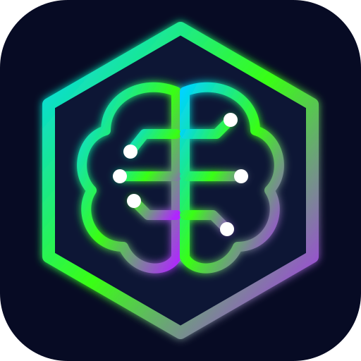
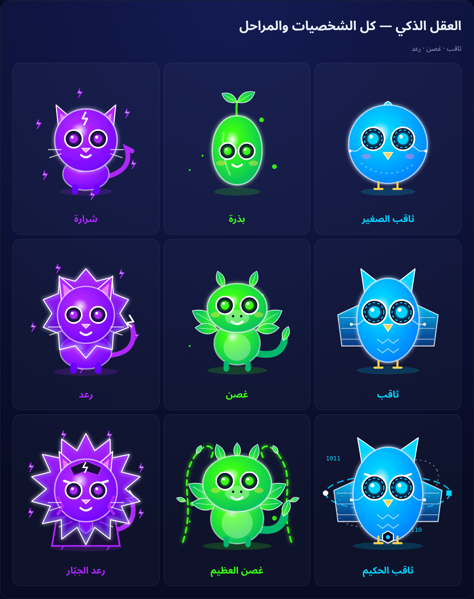

# العقل الذكي · Smart Mind

<p align="center"></p>

**رفيقك الرقمي العربي الذكي** — تطبيق ويب تقدّمي (PWA) مجاني، عربي بالكامل (RTL)، مصمم للجوال أولاً. اختر رفيقاً رقمياً، تحدّث معه بالكتابة أو الصوت، وشاهده يتطور كلما قويت رابطتكما.

🔗 **جرّبه الآن:** https://algawhar2020.github.io/smart-mind/

<p align="center"></p>

## الرفاق
| | الرفيق | القيمة | المراحل |
|---|---|---|---|
| 🦉 | **ثاقب** `#00D4FF` | الذكاء والثقة | ثاقب الصغير ← ثاقب ← ثاقب الحكيم |
| 🌱 | **غُصن** `#39FF14` | النمو والفضول | بذرة ← غصن ← غصن العظيم |
| ⚡ | **رعد** `#B026FF` | القوة والحماية | شرارة ← رعد ← رعد الجبّار |

التفاصيل الكاملة: [docs/characters.md](docs/characters.md)

## المزايا
- **شخصيات حيّة (SVG متحرك):** طفو، رمش، تتفاعل مع الكتابة، تفكير، كلام، مشاعر مستنتجة من الرد، ومداعبة بالنقر.
- **جهاز «رابط»:** سوار بشاشة سداسية يعرض مقياس الرابطة وتقدّم التطور.
- **التطور:** نقاط رابطة (محفوظة محلياً) من المحادثات والزيارات اليومية، مع حركة تطور عند العتبات (30 و100)، وزر «اختبار التطور» في الإعدادات.
- **الصوت:** نطق عربي عبر `speechSynthesis` بطبقة وسرعة مختلفة لكل رفيق، وميكروفون `SpeechRecognition` (ar-SA) مع بديل.
- **الذكاء:** دماغ تجريبي عربي يعمل بدون إنترنت ولا إعداد، لكل رفيق شخصيته. واختيارياً: مفتاح **Google Gemini** المجاني الخاص بك (يُحفظ في جهازك فقط) مع رجوع تلقائي للدماغ التجريبي عند الخطأ.
- **PWA:** قابل للتثبيت على الشاشة الرئيسية ويعمل دون اتصال.

## الحصول على مفتاح Gemini مجاني
1. افتح https://aistudio.google.com/apikey وسجّل الدخول بحساب Google.
2. اضغط **Create API key** وانسخ المفتاح.
3. في التطبيق: ⚙️ الإعدادات ← الذكاء الاصطناعي ← الصق المفتاح ← «اختبار المفتاح».
> المفتاح يُحفظ في `localStorage` على جهازك فقط ويُرسل مباشرة إلى Google. الطبقة المجانية لها حدود استخدام، وقد تُستخدم البيانات لتحسين منتجات Google.

## التشغيل محلياً
```bash
python3 -m http.server 8000   # ثم افتح http://localhost:8000
```
لا يوجد build step — HTML/CSS/JS خالص.

## البنية
```
index.html · css/style.css · manifest.webmanifest · sw.js
js/characters.js  تعريف الرفاق والأصوات والتعليمات
js/avatar.js      رسم الشخصيات SVG بكل المراحل
js/ai.js          الدماغ التجريبي + Gemini
js/voice.js       النطق والتعرّف على الكلام
js/evolution.js   الرابطة والتطور
js/app.js         الواجهة والمنطق
docs/             وثيقة الشخصيات واللوحات
tools/            توليد الأيقونات/اللوحات والاختبار الآلي (Playwright)
```

## خارطة الطريق
- [ ] مراحل تطور إضافية وأشكال بديلة حسب أسلوب المحادثة
- [ ] ذاكرة طويلة المدى وملخص يومي
- [ ] مهام يومية وألعاب صغيرة لكسب نقاط الرابطة
- [ ] أصوات مخصصة (TTS سحابي اختياري)
- [ ] مزامنة سحابية اختيارية بين الأجهزة
- [ ] تطبيق أندرويد (TWA) ونسخة iOS
- [ ] رسوم متحركة Lottie/Rive أكثر تفصيلاً

---

## English

**Smart Mind (العقل الذكي)** is a free, mobile‑first Arabic AI companion PWA. Pick one of three original digital partners — **Thaqib** (neon‑blue owl, intelligence & trust), **Ghusn** (phosphor‑green plant dragon, growth & curiosity) or **Raad** (electric‑purple lion, power & protection) — and bond with it through the **«Rabit»** wristband HUD (hexagon screen showing bond meter and evolution progress).

- Animated SVG characters: idle float/blink, typing reaction, thinking/talking, emotions from replies, tap‑to‑poke.
- Bond points (localStorage) from chats and daily visits; 3 evolution stages per character with an evolution animation; “test evolution” in Settings.
- Voice: Arabic `speechSynthesis` with per‑character pitch/rate; `SpeechRecognition` (ar‑SA) mic with keyboard‑dictation fallback.
- AI: offline Arabic demo brain (zero setup) + optional user‑supplied free Google Gemini key (stored locally only; default model `gemini-2.5-flash`, auto‑fallback to other models and to the demo brain).
- Vanilla HTML/CSS/JS, no build step, installable and offline‑capable.

**Live:** https://algawhar2020.github.io/smart-mind/ · **Get a free Gemini key:** https://aistudio.google.com/apikey

**Limitations:** Arabic TTS depends on the device’s installed voices (Android/Chrome usually has Google Arabic; iPhone Safari has “Maged”/“Majed” Arabic voice if available in iOS settings; desktop Linux often has none). Speech recognition works in Chrome/Edge/Android and Safari (iOS 14.5+); Firefox lacks it — use keyboard dictation.

All characters, names and designs are original. License: MIT.
